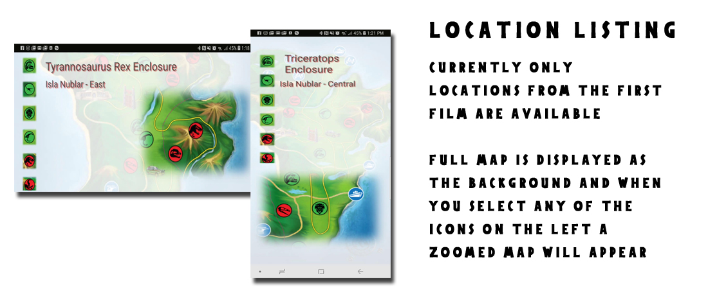
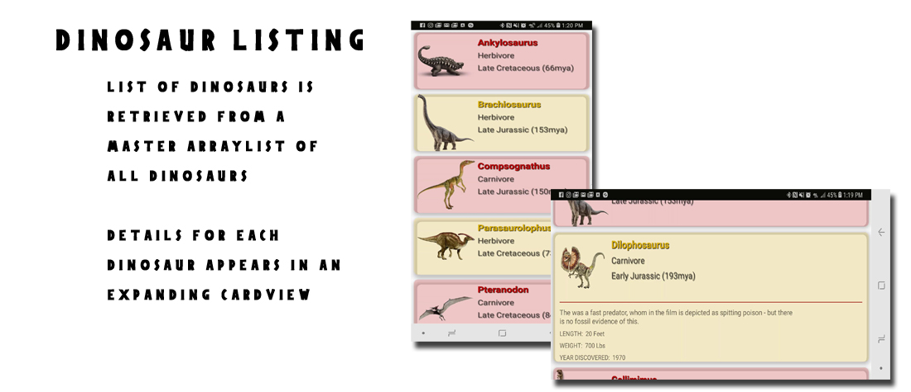
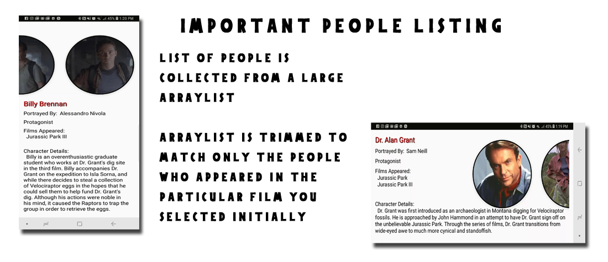
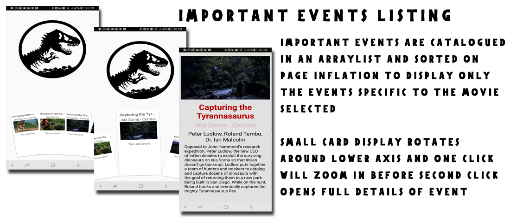

# JurassicTourGuide

This is a Tour Guide through the Jurassic Park films and was designed as part of Project 5 in the Grow With Google Udacity Program

## APPLICATION FEATURES

This app has several elements as a 'tour guide' From the main page you can choose to learn more about each unique film through the TabLayoutMenu at the top of the application.

The TabLayout pairs with the ViewPager that inflates the views for each unique film. The backgrounds for each view are taken directly from each unique film.

By selecting an item you will be taken to that particular collection of data. All the data in the application is stored directly in 4 master ArrayLists which are created and collected from a custom class.

The four sections of this app are: Important Locations, Dinosaurs, People and Events.

